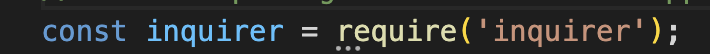

# Node

## Description

Coding is not the most intuitive language. Therefore, the importance of a README is immeasurable. The reason why is because a README holds several purposes. One purpose is to explain the work that's been created, in a way that anyone visiting one's repo (repository) can understand. Another purpose is to showcase the hard work that's been done, and highlight accomplishments, in addition to sharing what was learned throughout the process. For this project, my task was to create a README utilizing node. [Node](https://www.youtube.com/watch?v=TlB_eWDSMt4) is a "program that includes V8 JS engine (Google Chrome), plus additional modules that give us capabilities not in a browser." So what does this mean? It means that one can utilize JavaScript, without leaving the terminal! It is not a programming language, but instead is a "runtime environment for executing JavaScript code". To see the steps I've taken to create this README, please continue to read along. I hope you enjoy and learn something new!


## Table of Contents 

- [Installation](#installation)
- [Usage](#usage)
- [Credits](#credits)
- [License](#license)
- [Test](#tests)


## Installation
What are the steps required to install your project? Provide a step-by-step description of how to get the development environment running.

1. Create a repository that includes node.
2. Create a JavaScript file. This is done by typing the following line of code into the terminal:
```
node touch index.js
```
3. Within the JS file, the first line of code that should be written is:


## Usage

Provide instructions and examples for use. Include screenshots as needed.

To add a screenshot, create an `assets/images` folder in your repository and upload your screenshot to it. Then, using the relative filepath, add it to your README using the following syntax:

    ```md
    
    ```

## Credits

List your collaborators, if any, with links to their GitHub profiles.

If you used any third-party assets that require attribution, list the creators with links to their primary web presence in this section.

If you followed tutorials, include links to those here as well.

## License

The last section of a high-quality README file is the license. This lets other developers know what they can and cannot do with your project. If you need help choosing a license, refer to [https://choosealicense.com/](https://choosealicense.com/).

```
MIT License

Copyright (c) 2022 AmyLipscomb

Permission is hereby granted, free of charge, to any person obtaining a copy
of this software and associated documentation files (the "Software"), to deal
in the Software without restriction, including without limitation the rights
to use, copy, modify, merge, publish, distribute, sublicense, and/or sell
copies of the Software, and to permit persons to whom the Software is
furnished to do so, subject to the following conditions:

The above copyright notice and this permission notice shall be included in all
copies or substantial portions of the Software.

THE SOFTWARE IS PROVIDED "AS IS", WITHOUT WARRANTY OF ANY KIND, EXPRESS OR
IMPLIED, INCLUDING BUT NOT LIMITED TO THE WARRANTIES OF MERCHANTABILITY,
FITNESS FOR A PARTICULAR PURPOSE AND NONINFRINGEMENT. IN NO EVENT SHALL THE
AUTHORS OR COPYRIGHT HOLDERS BE LIABLE FOR ANY CLAIM, DAMAGES OR OTHER
LIABILITY, WHETHER IN AN ACTION OF CONTRACT, TORT OR OTHERWISE, ARISING FROM,
OUT OF OR IN CONNECTION WITH THE SOFTWARE OR THE USE OR OTHER DEALINGS IN THE
SOFTWARE.
```

---

🏆 The previous sections are the bare minimum, and your project will ultimately determine the content of this document. You might also want to consider adding the following sections.

## Badges


Badges aren't necessary, per se, but they demonstrate street cred. Badges let other developers know that you know what you're doing. Check out the badges hosted by [shields.io](https://shields.io/). You may not understand what they all represent now, but you will in time.

## Features

If your project has a lot of features, list them here.

## How to Contribute

If you created an application or package and would like other developers to contribute it, you can include guidelines for how to do so. The [Contributor Covenant](https://www.contributor-covenant.org/) is an industry standard, but you can always write your own if you'd prefer.

## Tests

Go the extra mile and write tests for your application. Then provide examples on how to run them here.